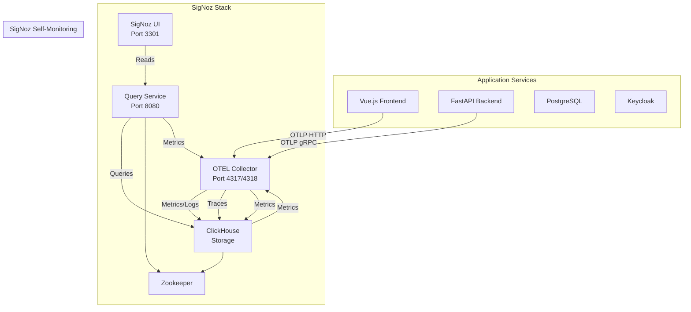

# SigNoz OSS Integration Plan

## Overview

This plan integrates SigNoz OSS observability platform into the Farsight application to provide distributed tracing, metrics, and logs. The implementation includes:

- **Full-stack instrumentation**: Backend (FastAPI) and frontend (Vue.js)
- **Error-based sampling**: 100% of error traces, 10% of success traces
- **7-day data retention** in ClickHouse
- **Self-monitoring**: Monitor SigNoz services themselves
- **Local deployment only**

## Architecture



## Implementation Steps

### 1. Docker Infrastructure Setup

**File: `docker-compose.yml`**

Add the following services:

- **ClickHouse**: Main storage with 7-day TTL configuration
- **ClickHouse Zookeeper**: Required for ClickHouse coordination
- **OTEL Collector**: Receives telemetry from app services
- **SigNoz Query Service**: Processes queries from UI
- **SigNoz Frontend**: Web UI dashboard (port 3301)
- **OTEL Collector (for SigNoz)**: Separate collector for self-monitoring

All services join the existing `farsight_network`. Add persistent volumes for ClickHouse data.

**Key configurations:**

- ClickHouse: 7-day TTL via table configuration
- OTEL Collector: OTLP receivers (gRPC 4317, HTTP 4318), ClickHouse exporter
- Network isolation: All services on same network for internal communication
- Health checks: Add health checks for all new services

### 2. OTEL Collector Configuration

**New directory: `otel-collector/`**

**File: `otel-collector/config.yaml`**

Configure:

- **Receivers**:
  - `otlp` (gRPC on 4317, HTTP on 4318)
  - `hostmetrics` for container/system metrics
  - `prometheus` for SigNoz self-monitoring endpoints
- **Processors**:
  - `batch` for efficient batching
  - `resource` for adding service metadata
  - `attributes` for adding custom attributes
  - Note: Error-based sampling handled in application code (see step 3)
- **Exporters**:
  - `clickhouse` exporter pointing to ClickHouse service
  - Configure traces, metrics, and logs tables
- **Service pipelines**: Connect receivers → processors → exporters

**File: `otel-collector/config-signoz.yaml`** (optional, for separate self-monitoring collector)

Similar configuration but with receivers targeting SigNoz service metrics endpoints.

### 3. Backend Instrumentation (Python/FastAPI)

**File: `backend/requirements.txt`**

Add OpenTelemetry packages:

```
opentelemetry-api==1.21.0
opentelemetry-sdk==1.21.0
opentelemetry-instrumentation-fastapi==0.42b0
opentelemetry-instrumentation-sqlalchemy==0.42b0
opentelemetry-instrumentation-httpx==0.42b0
opentelemetry-instrumentation-requests==0.42b0
opentelemetry-exporter-otlp-proto-grpc==1.21.0
opentelemetry-semantic-conventions==0.42b0
```

**New file: `backend/app/core/observability.py`**

Create observability initialization module:

- Initialize OpenTelemetry SDK
- Configure OTLP gRPC exporter pointing to `otel-collector:4317`
- Implement custom error-based sampler:
  - Check span status/attributes for errors (http.status_code >= 400, exceptions, etc.)
  - Return `RECORD_AND_SAMPLE` for error spans (100% sampling)
  - Return `RECORD_AND_SAMPLE` with 10% probability for success spans
  - Ensure parent-child trace consistency
- Auto-instrument FastAPI, SQLAlchemy, httpx, requests
- Set service name from environment: `OTEL_SERVICE_NAME` (default: `farsight-backend`)
- Configure resource attributes (environment, version, etc.)

**File: `backend/app/main.py`**

Modify to:

- Import and initialize observability before FastAPI app creation
- Ensure tracing middleware is active
- Preserve existing exception handlers (they'll automatically capture errors for tracing)

**File: `backend/app/core/config.py`**

Add OTEL configuration settings:

- `OTEL_EXPORTER_OTLP_ENDPOINT` (default: `http://otel-collector:4317`)
- `OTEL_SERVICE_NAME` (default: `farsight-backend`)
- `OTEL_TRACE_SAMPLE_RATE` (default: `0.1` for 10% success)
- `OTEL_TRACE_ERROR_SAMPLE_RATE` (default: `1.0` for 100% errors)
- `OTEL_ENABLED` (flag to enable/disable)

**New file: `backend/app/middleware/tracing.py`** (optional, for custom spans)

Create middleware for:

- Adding custom spans for business logic (CSV processing, facts computation)
- Capturing request metadata in spans
- Correlating request IDs with trace IDs
- Adding custom attributes for business context

**Modify service files** (optional, for enhanced tracing):

Add custom spans in:

- `backend/app/services/csv_ingestion_service.py`: Wrap CSV processing
- `backend/app/services/facts_computation_service.py`: Wrap facts computation
- `backend/app/services/hybrid_facts_service.py`: Wrap hybrid facts
- `backend/app/services/graph_service.py`: Wrap graph generation

Use context managers or decorators to create spans with meaningful names and attributes.

### 4. Frontend Instrumentation (Vue.js)

**File: `frontend/package.json`**

Add OpenTelemetry packages:

```json
"@opentelemetry/api": "^1.7.0",
"@opentelemetry/sdk-trace-web": "^1.15.0",
"@opentelemetry/instrumentation": "^0.46.0",
"@opentelemetry/instrumentation-document-load": "^0.36.0",
"@opentelemetry/instrumentation-fetch": "^0.40.0",
"@opentelemetry/exporter-trace-otlp-http": "^0.45.0",
"@opentelemetry/semantic-conventions": "^1.15.0"
```

**New directory: `frontend/src/instrumentation/`**

**File: `frontend/src/instrumentation/tracing.js`**

Create tracing initialization:

- Initialize OpenTelemetry Web SDK
- Configure OTLP HTTP exporter pointing to `http://localhost:4318/v1/traces`
- Implement error-based sampler (similar to backend):
  - Check HTTP status codes in fetch responses
  - Check for JavaScript exceptions
  - 100% sampling for errors, 10% for success
- Auto-instrument:
  - `fetch` API (catches axios requests)
  - `document.load` events
- Set service name: `farsight-frontend`
- Configure resource attributes

**File: `frontend/src/instrumentation/error-handler.js`**

Create global error handler:

- Catch unhandled JavaScript errors
- Create error spans with stack traces
- Link errors to active traces
- Send to OTEL collector

**File: `frontend/src/main.js`**

Modify to:

- Import and initialize tracing before app creation
- Set up global error handler
- Ensure tracing is active before router initialization

**File: `frontend/src/services/api.js`**

Modify axios interceptor to:

- Add trace context to request headers (W3C Trace Context)
- Capture HTTP errors for 100% sampling
- Link failed requests to traces

**New file: `frontend/src/composables/useTracing.js`** (optional)

Create composable for:

- Manual span creation for critical user actions
- Page navigation tracking (complement Vue Router instrumentation)
- Custom event tracking

### 5. SigNoz Self-Monitoring Setup

**In `docker-compose.yml`:**

Add metrics scraping for SigNoz services:

- **ClickHouse metrics**: Scrape from ClickHouse HTTP metrics endpoint (port 8123)
- **Query Service metrics**: Scrape from Prometheus metrics endpoint (if available)
- **OTEL Collector metrics**: Scrape from collector's internal Prometheus endpoint
- **Frontend health**: Basic health check endpoint

Configure OTEL Collector to:

- Scrape SigNoz service metrics via `prometheus` receiver
- Add service name prefixes: `signoz-clickhouse`, `signoz-query-service`, `signoz-otel-collector`
- Export to same ClickHouse instance but with distinct service tags

### 6. ClickHouse Retention Configuration

**In docker-compose.yml or separate init script:**

Configure ClickHouse tables with 7-day TTL:

- Traces table: TTL `timestamp + INTERVAL 7 DAY`
- Metrics table: TTL `timestamp + INTERVAL 7 DAY`
- Logs table: TTL `timestamp + INTERVAL 7 DAY`

This ensures automatic cleanup after 7 days. SigNoz Query Service should handle table creation, but verify TTL settings.

### 7. Environment Variables

**Update `.env.example` or create environment documentation:**

Add OTEL variables:

```env
# OpenTelemetry Configuration
OTEL_ENABLED=true
OTEL_EXPORTER_OTLP_ENDPOINT=http://otel-collector:4317
OTEL_SERVICE_NAME=farsight-backend
OTEL_TRACE_SAMPLE_RATE=0.1
OTEL_TRACE_ERROR_SAMPLE_RATE=1.0

# Frontend OTEL (different endpoint for HTTP)
VITE_OTEL_EXPORTER_OTLP_ENDPOINT=http://localhost:4318/v1/traces
VITE_OTEL_SERVICE_NAME=farsight-frontend

# SigNoz UI
SIGNOZ_UI_URL=http://localhost:3301
```

### 8. Testing & Validation

**Testing checklist:**

1. Verify all services start correctly in docker-compose
2. Check SigNoz UI is accessible at `http://localhost:3301`
3. Make API requests from frontend and verify traces appear
4. Trigger errors (4xx, 5xx) and verify 100% sampling
5. Generate successful requests and verify 10% sampling
6. Check that SigNoz services appear in dashboard (self-monitoring)
7. Verify 7-day retention: check ClickHouse TTL settings
8. Test trace correlation: request ID should correlate with trace ID
9. Verify database query traces are captured
10. Check frontend page load and navigation traces

## Files to Create/Modify

### New Files:

- `otel-collector/config.yaml`
- `backend/app/core/observability.py`
- `backend/app/middleware/tracing.py` (optional)
- `frontend/src/instrumentation/tracing.js`
- `frontend/src/instrumentation/error-handler.js`
- `frontend/src/composables/useTracing.js` (optional)

### Modified Files:

- `docker-compose.yml` (add SigNoz services, volumes, networks)
- `backend/requirements.txt` (add OTEL packages)
- `backend/app/main.py` (initialize observability)
- `backend/app/core/config.py` (add OTEL settings)
- `frontend/package.json` (add OTEL packages)
- `frontend/src/main.js` (initialize tracing)
- `frontend/src/services/api.js` (add trace context)

### Optional Enhancements:

- Add custom spans to service files for better granularity
- Create SigNoz dashboard templates for common queries
- Add alerting rules (if AlertManager is configured)

## Dependencies & Resources

**Backend:**

- OpenTelemetry Python SDK and instrumentations
- ~50MB additional image size
- Minimal runtime overhead (~1-3% CPU)

**Frontend:**

- OpenTelemetry JavaScript SDK and instrumentations
- ~200KB bundle size increase (minified)
- Minimal runtime overhead

**Infrastructure:**

- Additional ~4-8GB RAM for SigNoz stack
- ~10-20GB disk space for 7-day data retention
- Network bandwidth for telemetry data

## Success Criteria

- All SigNoz services start and remain healthy
- Traces appear in SigNoz UI for both frontend and backend
- Error traces (4xx, 5xx) are 100% sampled
- Success traces (2xx) are approximately 10% sampled
- SigNoz services are visible in monitoring dashboard
- Data retention works correctly (data older than 7 days is cleaned)
- Trace correlation works (request ID ↔ trace ID)
- No significant performance degradation (<5% overhead)

## Notes

- Error-based sampling is implemented in application code (both backend and frontend) since OTEL Collector doesn't have native error-based sampling processor
- Frontend uses HTTP endpoint (4318) instead of gRPC (4317) for browser compatibility
- Self-monitoring may require additional configuration in SigNoz Query Service to expose metrics
- ClickHouse TTL configuration may need to be set via SigNoz UI or direct SQL if not auto-configured