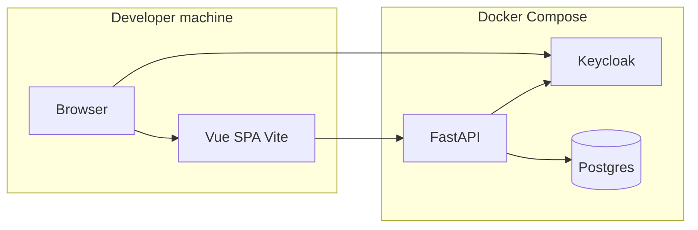

# Farsight

Farsight is a **firewall access rule (FAR) analysis** application. You work inside **projects**: upload firewall rule CSVs, optionally load an **asset registry** for enrichment, and explore rules, facts, and analysis through a **Vue** frontend. The **FastAPI** backend is protected with **Keycloak** (JWT).

## Architecture

- The browser talks to the SPA and to Keycloak on **localhost** (typical dev).
- The SPA calls the API on **localhost:8000** (Vite proxies `/api` to the backend in development).
- Inside Docker Compose, the backend uses **`http://keycloak:8080`** to validate tokens and **`postgres`** as the database host.



## Repository layout

| Path | Purpose |
|------|---------|
| [backend/](backend/) | FastAPI app, Alembic migrations, services |
| [frontend/](frontend/) | Vue 3 + Vite UI |
| [keycloak/import/](keycloak/import/) | Realm export for local Keycloak (`--import-realm`) |
| [samples/](samples/) | Small CSV examples for asset registry and FAR uploads |
| [tests/testdata_generation/](tests/testdata_generation/) | Generators for larger synthetic CSVs |
| [docker-compose.yml](docker-compose.yml) | Postgres, Keycloak, backend, pgAdmin, Swagger UI |

## Prerequisites

- **Docker** and **Docker Compose** (recommended for Postgres, Keycloak, and API)
- **Node.js** and **npm** (for the frontend; not containerized in Compose)
- **Python 3** (only if you run the backend or Alembic on the host instead of in Docker)

## Quick start

### 1. Environment

Copy the example env file and set secrets:

```bash
cp .env.example .env
```

**Required for `docker compose up`:** set at least `POSTGRES_PASSWORD`, `KEYCLOAK_ADMIN_PASSWORD`, `KEYCLOAK_CLIENT_SECRET`, and `PGADMIN_PASSWORD`. Use the **same** `POSTGRES_PASSWORD` in `DATABASE_URL` when you run tools on the host against the Compose-published Postgres port.

**Keycloak client secret:** `KEYCLOAK_CLIENT_SECRET` must match the **`farsight-backend`** confidential client secret in [keycloak/import/farsight-realm.json](keycloak/import/farsight-realm.json). If you change the secret in that JSON, update `.env` accordingly. See [.env.example](.env.example) for all related variables.

### 2. Backend stack (Compose)

From the repository root:

```bash
docker compose up --build
```

The backend container runs **`alembic upgrade head`** then **`uvicorn`** (see [docker-compose.yml](docker-compose.yml)). Wait for Postgres and Keycloak to become healthy before using the API.

### 3. Frontend (host)

```bash
cd frontend
npm install
npm run dev
```

Open [http://localhost:3000](http://localhost:3000) (port is set in [frontend/vite.config.js](frontend/vite.config.js)).

Optional [frontend](frontend/) environment variables (defaults work for local dev):

- `VITE_API_BASE_URL` — API base URL (default `http://localhost:8000`)
- `VITE_KEYCLOAK_URL`, `VITE_KEYCLOAK_REALM`, `VITE_KEYCLOAK_CLIENT_ID` — see [frontend/src/services/keycloak.ts](frontend/src/services/keycloak.ts)

## Service URLs (default ports)

| Service | URL | Notes |
|---------|-----|--------|
| API | [http://localhost:8000](http://localhost:8000) | Interactive docs: `/docs`, OpenAPI: `/openapi.json` |
| Keycloak | [http://localhost:8080](http://localhost:8080) | Realm: `farsight` |
| Swagger UI (container) | [http://localhost:8081](http://localhost:8081) | Uses `SWAGGER_PORT` (default **8081** in Compose) |
| pgAdmin | [http://localhost:5050](http://localhost:5050) | Uses `PGADMIN_PORT` |

## Sample CSV uploads

Curated files live under [samples/](samples/). Upload the asset registry CSV before the FAR rules CSV if you want IP enrichment to line up. See [samples/README.md](samples/README.md) for API paths and field names.

## Local development (backend on the host)

1. Run Postgres and Keycloak (e.g. via Docker Compose, or your own installs).
2. Point `DATABASE_URL` (or `POSTGRES_*`) at Postgres on **localhost** with the same database name and credentials as Compose.
3. For JWT validation, set `KEYCLOAK_URL` to **http://localhost:8080** when the backend runs on the host (not `http://keycloak:8080`).
4. From `backend/`: create a virtualenv, install dependencies, then:

   ```bash
   alembic upgrade head
   uvicorn app.main:app --reload --host 0.0.0.0 --port 8000
   ```

Risky-port policy seeding and admin scripts are described in [backend/README.md](backend/README.md).

## Testing and synthetic data

- **Backend:** from `backend/`, run `PYTHONPATH=. pytest` (install dependencies from `backend/requirements.txt` first).
- **Frontend:** `npm test` in [frontend/](frontend/).
- **Large generated CSVs:** [tests/testdata_generation/README.md](tests/testdata_generation/README.md) (generators; most `*.csv` files are gitignored except [samples/](samples/)).

## Further reading

- [backend/README.md](backend/README.md) — risky port policy seeding
- [frontend/README.md](frontend/README.md) — Vue/Vite scripts and structure

No `LICENSE` file is present in this repository; add one if you distribute the project.
